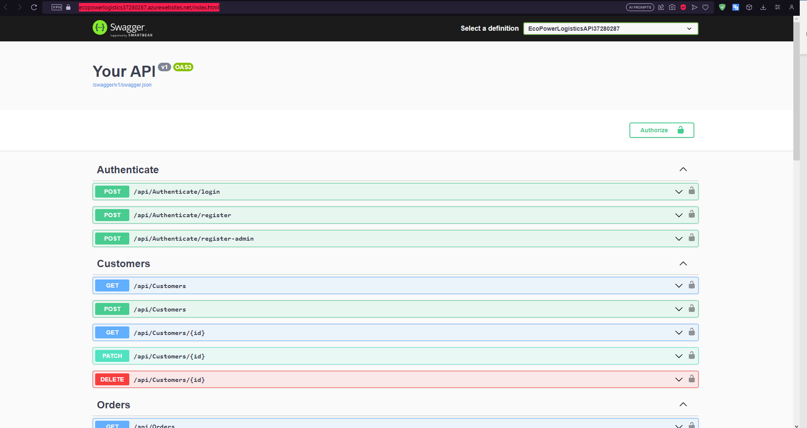
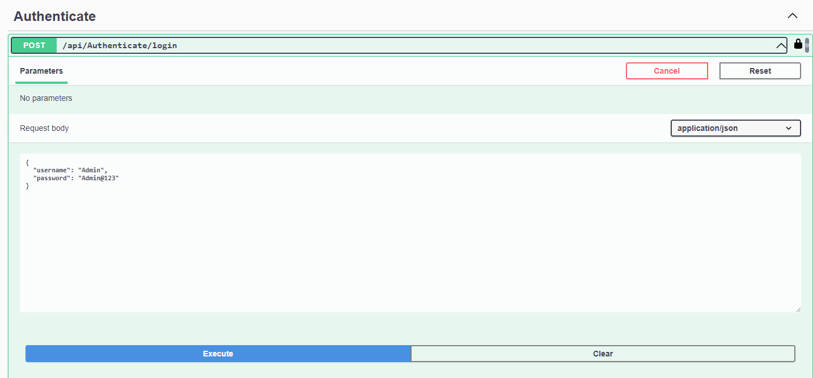
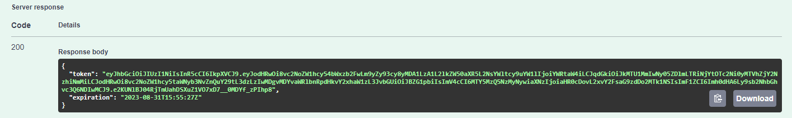
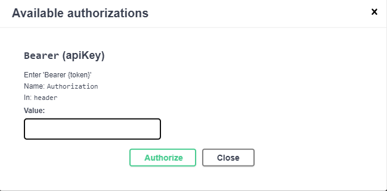
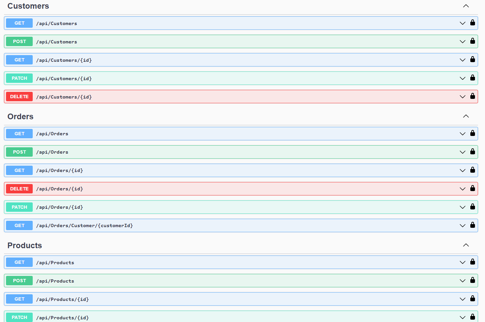

# CMPG-323-Project-2---37280287
## Info
This Project is to create a RESTful Web API in Visual Studio using the ASP.NET CORE Framework mainly in C#.

## How to use API:
- Navigate to the following website: https://ecopowerlogistics37280287.azurewebsites.net/index.html
- The following will then be displayed:

- Here you can Read, Update, Create, and Delete Entries from Customers, Products, OrderDetails, and Orders. You have to log in first though.
- To log in, you have to navigate to the Authentication sections and drop down the Login request. The 2 other requests are to register new Users/Admins.

- Fill in the login form with a valid username & password. In this instance you can log in with username: Admin, password: Admin@123.

- After successfully logging in, you will get a token that you have to copy.

- Click on the authorize button at the top right.

- Now you will need to type "Bearer" along with your token inside of the text box.

- Once you are logged in, you will see a closed lock icon next to the endpoints, this means you ate successfully logged in, and you will have access to all the requests.

- Select a request that you want to try and click on "Try it out".

- After you have pressed executed on one of the requests, you will receive output accordingly.

## Reference List
Reference list:
- Asynchronous programming with async and await. (2022, August 04). Retrieved from Microsoft: https://docs.microsoft.com/en-us/dotnet/csharp/programming-guide/concepts/async/
- Bladoszewski, K. (2020, April 21). How to Join 3 Tables (or More) in SQL. Retrieved from LearnSQL: https://learnsql.com/blog/how-to-join-3-tables-or-more-in-sql/
- Callan, D. (2020, August 31). Reading Entity Framework Core connection string from appSettings.json. Retrieved from .NET Blog: https://davecallan.com/reading-entity-framework-core-connection-string-appsettings/
- Connection Strings. (2021, January 28). Retrieved from Microsoft: https://docs.microsoft.com/en-us/ef/core/miscellaneous/connection-strings
- Entity Framework Core. (n.d.). Retrieved from Joining: https://entityframeworkcore.com/querying-data-joining#:~:text=Entity%20Framework%20Core%20Joining&text=In%20SQL%2C%20a%20JOIN%20clause,using%20the%20Join()%20method.
- Entity Framework Join 3 Tables. (2014, January 10). Retrieved from Stackoverflow: https://stackoverflow.com/questions/21051612/entity-framework-join-3-tables
- Entity Framework Joining 3 Tables Together. (2017, September 27). Retrieved from stackoverflow: https://stackoverflow.com/questions/46453286/entity-framework-joining-3-tables-together
- How can I ignore files that have already been committed to the repo? (2022, September 1). Retrieved from Tower: https://www.git-tower.com/learn/git/faq/ignore-tracked-files-in-git
- Join Query In Entity Framework. (2017, December 2). Retrieved from TekTutorialsHub: https://www.tektutorialshub.com/entity-framework/join-query-entity-framework/
- Lemonaki, D. (2022, August 22). .gitignore File – How to Ignore Files and Folders in Git. Retrieved from freeCodeCamp: https://www.freecodecamp.org/news/gitignore-file-how-to-ignore-files-and-folders-in-git/
- Managing Connection Strings in Entity Framework Core. (2019, May 08). Retrieved from Learn Entiry Framework Core: https://www.learnentityframeworkcore.com/connection-strings
- SnehaAgrawal-MSFT. (2021, December 21). 500 Internal Server Error in App Service. Retrieved from Microsoft docs: https://docs.microsoft.com/en-us/answers/questions/668644/500-internal-server-error-in-app-service.html

